## Исходное задание

Задание доступно по [ссылке](https://github.com/netology-code/08-ansible-01-base_02.25/tree/e9a635399ac3bc3063bd52d58a5ad1ef3da0a863) или в [README-TASK.md](README-TASK.md)

## Ответ на задание

Выполнение playbook:
```bash
ansible-playbook -i inventory/test.yml site.yml
```

В [site.yml](site.yml) значение переменной `some_fact` необходимо искать в выводе задания `Print fact`:

Значение в выводе равно 12:

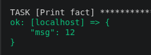

Данное значение было найдено в файле `group_vars/all/examp.yml`:
```yml
---
  some_fact: 12
```

Заменив его на `all default fact`, снова выполнил плейбук, значение в выводе изменилось:

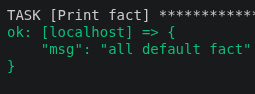


Для дальнейшей работы было подготовлено окружение:
```bash
# Установка CentOS и python3
docker run -d --name centos7 quay.io/centos/centos:stream9 sleep infinity
docker exec centos7 yum install -y python3

# Установка Ubuntu и python3
docker run -d --name ubuntu ubuntu:latest sleep infinity
docker exec ubuntu sh -c "apt-get update && apt-get install -y python3"
```


Выполняем запуск из окружения `prod.yml`:
```yml
ansible-playbook -i inventory/prod.yml site.yml
```

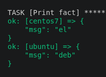

Далее были изменен файл `group_vars/deb/examp.yml`:
```yml
---
  some_fact: "deb default fact"
```

А также файл `group_vars/el/examp.yml`:
```yml
---
  some_fact: "el default fact"
```

Повторный запуск плейбука изменил выводимые значения:

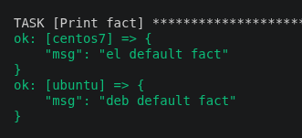

Далее данные в `group_vars/el` и `group_vars/deb` были зашифрованы паролем `netology`:
```bash
ansible-vault encrypt group_vars/deb/examp.yml
ansible-vault encrypt group_vars/el/examp.yml
```

Теперь при запуске playbook обязательно необходимо указать флаг `--ask-vault-pass`:
```bash
ansible-playbook -i inventory/prod.yml site.yml --ask-vault-pass
```

После запуска будет запрошен пароль:

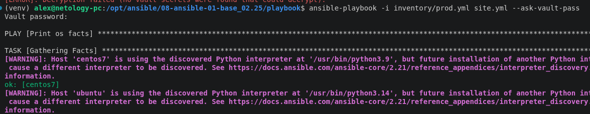


Посмотреть список плагинов для подключения можно командой:
```bash
ansible-doc --type connection --list
```

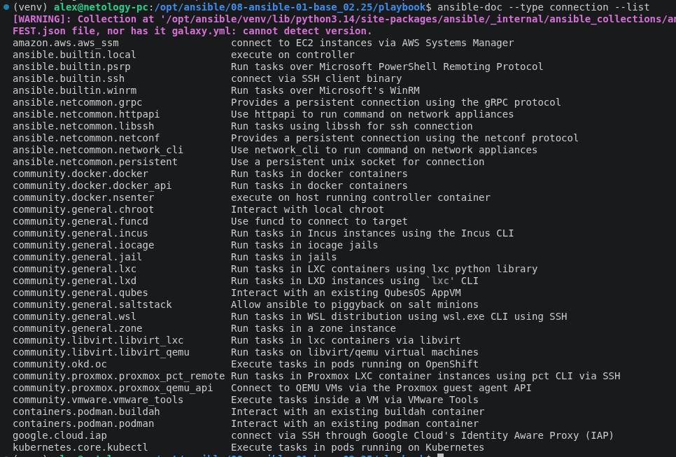


Далее в `prod.yml` была добавлена еще одна группа гостов с именем `local`, в ней размещен хост `localhost` с типом подключения `local`:
```yml
---
  el:
    hosts:
      centos7:
        ansible_connection: docker
  deb:
    hosts:
      ubuntu:
        ansible_connection: docker
  local:
    hosts:
      localhost:
        ansible_connection: local
```

После запуска плейбука были выведены значения `some_fact` для всех хостов:

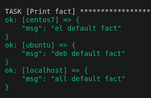


## Дополнительное задание

Расшифровать ранее зашифрованные переменные можно с помощью обратной команды:
```bash
ansible-vault decrypt group_vars/deb/examp.yml
ansible-vault decrypt group_vars/el/examp.yml
```

При вводе команды необходимо ввести пароль шифрования:

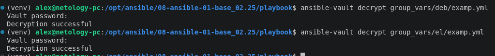

Далее было зашифровано отдельное значение `PaSSw0rd` с паролем `netology` командой `ansible-vault encrypt_string`:

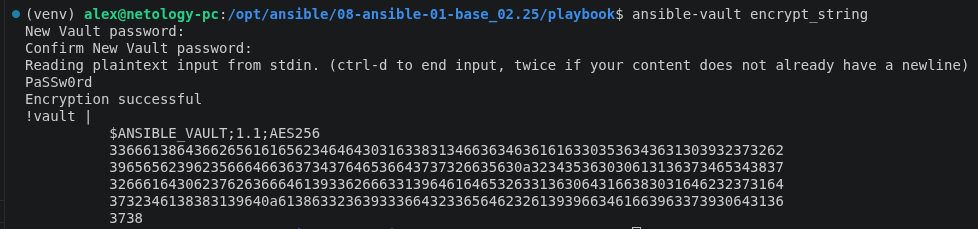

Полученное значение было вставлено в переменную `some_fact` файла `group_vars/all/exmp.yml`:
```yml
---
  some_fact: !vault |
          $ANSIBLE_VAULT;1.1;AES256
          38326136373765363739313465363162376139386664316634333031353538613264663634653734
          3036613835306631353162353636616562326639346266330a363038663034333761323139323631
          61323965653436336435323539636363363564303039336434326333626234343030313335306635
          6262656533626133660a653661386664313037656465633837333635626366306330313531373765
          6365
```

Запускаем плейбук:
```bash
ansible-playbook -i inventory/prod.yml site.yml --ask-vault-pass
```

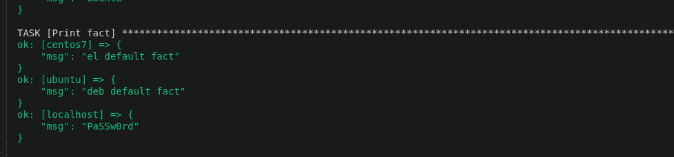


В был создан файл `group_vars/fedora/examp.yml`:
```yml
---
  some_fact: "additional task with fedora!"
```

В `inventory/prod.yml` создана новая группа хостов:
```yml
---
  el:
    hosts:
      centos7:
        ansible_connection: docker
  deb:
    hosts:
      ubuntu:
        ansible_connection: docker
  local:
    hosts:
      localhost:
        ansible_connection: local
  fedora:
    hosts:
      fedora_docker:
        ansible_connection: docker
```

Запущен контейнер:
```bash
docker run -d --name fedora_docker pycontribs/fedora:latest sleep infinity
```

Выполнен плейбук:

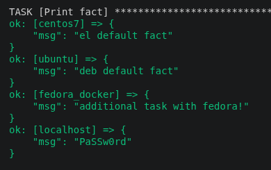


Для создания среды, запуска ansible-playbook и остановки контейнеров Docker был создан [скрипт](environment.sh):
```bash
#!/bin/bash

echo "Installing dependencies..."

# Install and run CentOS with python
docker run -d --name centos7 quay.io/centos/centos:stream9 sleep infinity > /dev/null 2>&1
docker exec centos7 yum install -y python3 > /dev/null 2>&1

# Install and run Ubuntu with python
docker run -d --name ubuntu ubuntu:latest sleep infinity > /dev/null 2>&1
docker exec ubuntu sh -c "apt-get update && apt-get install -y python3" > /dev/null 2>&1

# Install and run Fedora
docker run -d --name fedora_docker pycontribs/fedora:latest sleep infinity > /dev/null 2>&1

# Wait until dependencies installing
sleep 5

echo "Done."

ansible-playbook -i inventory/prod.yml site.yml --ask-vault-pass

echo "Removing Docker containers..."
docker rm -f ubuntu centos7 fedora_docker > /dev/null 2>&1

echo "Done."
```