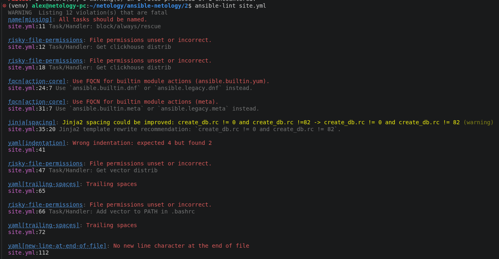
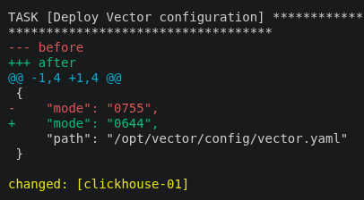

## Исходное задание

Задание доступно по [ссылке](https://github.com/netology-code/08-ansible-02-playbook_02.25/blob/89f523088db08c670e00077b145cb47d84976bad/README.md) или в [README-TASK.md](README-TASK.md)

## Ответ на задание

Для работы создал ВМ у Yandex CLoud с ОС Rocky Linux 10.

Перед работой изменил файл [inventory/prod.yml](inventory/prod.yml) и указал нужный IP и пользователя, от которого буду подключаться по SSH через Ansible.

Далее был создан [play](site.yml), устанавливающий и запускающий `vector` на хосте.

Последовательность действий:
1. Create vector user - создаёт системного пользователя vector без домашней директории и с shell nologin.

2. Create vector directory - создаёт каталог `{{ vector_path }}` с владельцем vector:vector и правами 0755.

3. Get vector distrib - скачивает архив Vector нужной версии с GitHub в домашнюю директорию.

4. Unarchive vector to home dir - распаковывает архив в домашнюю директорию (идемпотентно, через creates).

5. Copy vector files to `{{ vector_path }}` - копирует содержимое распакованной папки в `{{ vector_path }}` с сохранением прав.

6. Copy vector binary to /usr/local/bin - кладёт бинарник vector в /usr/local/bin/vector (чтобы systemd мог его запустить без проблем с SELinux).

7. Ensure vector data dir exists - создаёт /var/lib/vector с владельцем vector:vector и правами 0755.

8. Deploy Vector configuration - раскладывает конфиг vector.yaml из шаблона Jinja2 в `{{ vector_path }}/config/vector.yaml` (права 0644, владелец vector). При изменении триггерит handler Restart vector.

9. Deploy Vector systemd unit - раскладывает unit-файл vector.service из шаблона Jinja2 в /etc/systemd/system/. При изменении триггерит handler Restart vector.

10. Enable and start Vector service - включает автозагрузку и запускает сервис vector через systemd с daemon_reload.

11. Handler Restart vector - перезапускает сервис vector при изменении конфига или unit-файла.

В процессе разработки обращался к lint для валидации, исправлял ошибки:

Запуск с `--check` особо ничем не помог.

`--diff` показывал изменения в модуле `file`:

