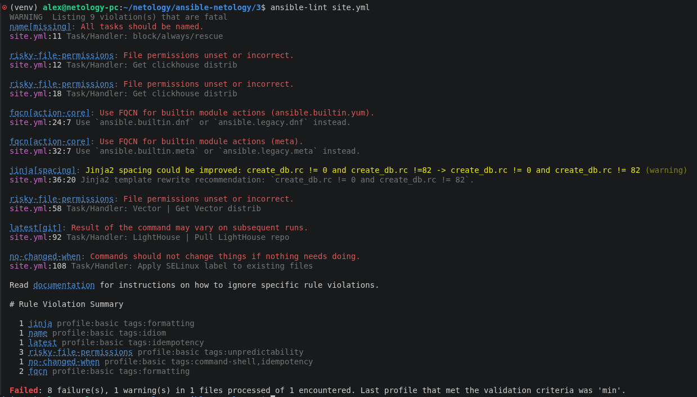
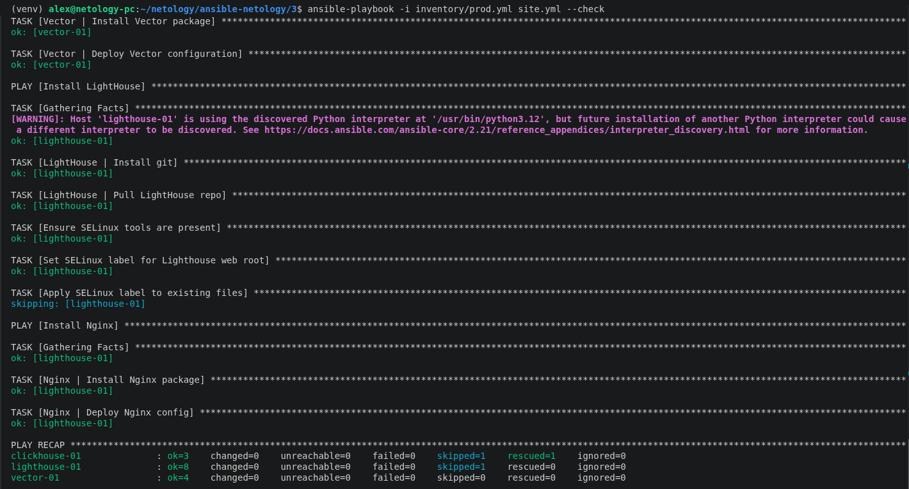
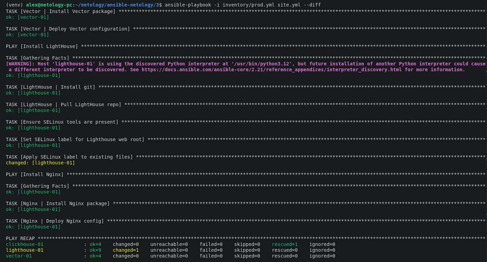
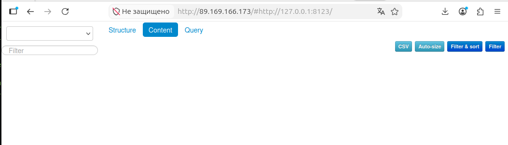

## Исходное задание

Задание доступно по [ссылке](https://github.com/netology-code/mnt-homeworks/blob/668e765338dea2738fb7c3572f073684ea00f214/08-ansible-03-yandex/README.md) или в [README-TASK.md](README-TASK.md)

## Ответ на задание

Для работы создал 3х ВМ в Yandex CLoud на базе ОС Rocky Linux 10.

Перед работой изменил файл [inventory/prod.yml](inventory/prod.yml) и указал нужные IP.

Далее были созданы [play-и](site.yml), устанавливающие и запускающие `Lighthouse` и `Nginx`.

В процессе разработки запускал  `ansible-lint` для валидации, исправлял ошибки:

В результате `Lighthouse` доступен по HTTP:

