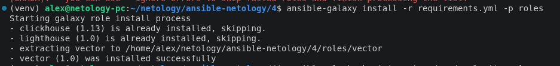
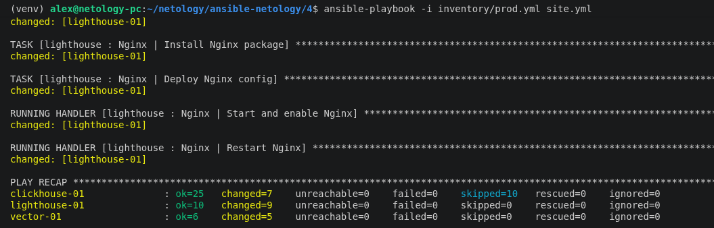
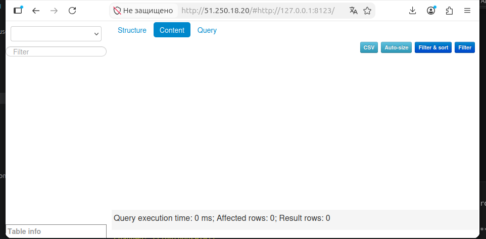

## Исходное задание

Задание доступно по [ссылке](https://github.com/netology-code/mnt-homeworks/blob/MNT-video/08-ansible-04-role/README.md) или в [README-TASK.md](README-TASK.md)

## Ответ на задание

Для работы создал 3х ВМ в Yandex CLoud на базе ОС Rocky Linux 10.

Перед работой изменил файл [inventory/prod.yml](inventory/prod.yml) и указал нужные IP.

Были реализованы 2 роли:
- установка [vector](https://github.com/AlexBerko/ansible-vector/blob/1.0/README.md)
- установка [lighthouse+nginx](https://github.com/AlexBerko/ansible-lighthouse/blob/1.0/README.md)

Далее они были применены в playbook:
```yml
---
- name: Install Clickhouse
  hosts: clickhouse
  roles:
    - clickhouse

- name: Install Vector
  hosts: vector
  roles:
    - vector

- name: Install LightHouse
  hosts: lighthouse
  become: true
  roles:
    - lighthouse
```

Описание зависимостей в файле [requirements.yml](requirements.yml)
```yml
---
  - src: https://github.com/AlexeySetevoi/ansible-clickhouse.git
    scm: git
    version: "1.13"
    name: clickhouse
  
  - src: https://github.com/AlexBerko/ansible-lighthouse.git
    scm: git
    version: "1.0"
    name: lighthouse

  - src: https://github.com/AlexBerko/ansible-vector.git
    scm: git
    version: "1.0"
    name: vector
```


Скачивание зависимостей командой:
```bash
ansible-galaxy install -r requirements.yml -p roles
```




Для работы playbook пришлось изменить роль clickhouse (roles/clickhouse/tasks/install/dnf.yml):
```yml
- name: Install by YUM | Ensure clickhouse package installed (version {{ clickhouse_version }})
  dnf:
    name: "{{ clickhouse_package | map('regex_replace', '$', '-' + clickhouse_version) | list }}"
    state: present
    disable_gpg_check: true 
  become: true
  tags: [install]
  when: clickhouse_version != 'latest'
```


Применение плейбука:



В результате `Lighthouse` доступен по HTTP:


