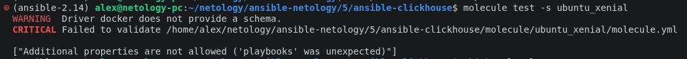
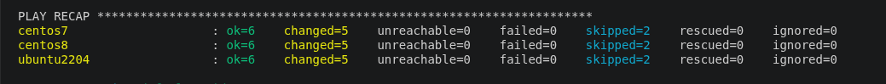
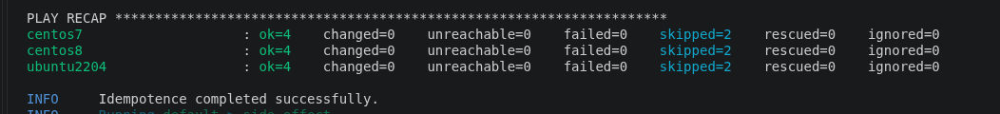
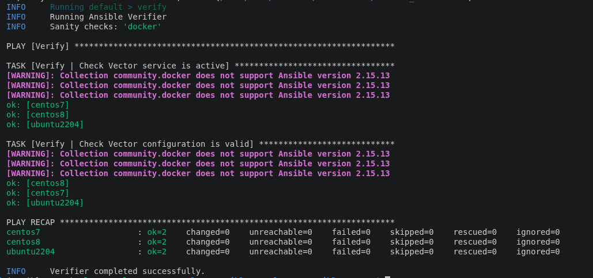
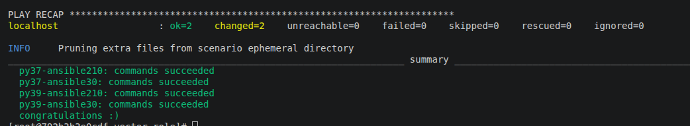

## Исходное задание

Задание доступно по [ссылке](https://github.com/netology-code/mnt-homeworks/blob/MNT-video/08-ansible-05-testing/README.md) или в [README-TASK.md](README-TASK.md)

## Ответ на задание

### Molecule

Выполнить команду `molecule test -s ubuntu_xenial` не удалось:



Далее был создан сценарий с помощью команды `molecule init scenario --driver-name docker`.

Написан [сценарий](https://github.com/AlexBerko/ansible-vector/blob/1.1/molecule/default/molecule.yml), запускающий роль на ОС CentOS 7, CentOS 8, Ubuntu 22.04:
```
platforms:
  - name: centos7
    image: geerlingguy/docker-centos7-ansible:latest
    command: ""
    privileged: true
    pre_build_image: true
    privileged: true
    cgroupns_mode: host
    volumes:
      - /sys/fs/cgroup:/sys/fs/cgroup:rw
    tmpfs:
      - /run
      - /tmp
    capabilities:
      - SYS_ADMIN
    ansible_python_interpreter: /usr/bin/python
  
  - name: centos8
    image: geerlingguy/docker-centos8-ansible:latest
    pre_build_image: true
    command: ""
    privileged: true
    cgroupns_mode: host
    volumes:
      - /sys/fs/cgroup:/sys/fs/cgroup:rw
    tmpfs:
      - /run
      - /tmp
    capabilities:
      - SYS_ADMIN
    ansible_python_interpreter: /usr/bin/python

  - name: ubuntu2204
    image: geerlingguy/docker-ubuntu2204-ansible:latest
    pre_build_image: true
    command: ""
    privileged: true
    cgroupns_mode: host
    volumes:
      - /sys/fs/cgroup:/sys/fs/cgroup:rw
    tmpfs:
      - /run
      - /tmp
    capabilities:
      - SYS_ADMIN
    ansible_python_interpreter: /usr/bin/python3
```

Для поддержки нескольких семейств операционных систем были изменены [таски](https://github.com/AlexBerko/ansible-vector/blob/1.1/tasks/main.yml) и добавлено условие `when`, например:
```
- name: Vector | Install Vector package (RPM)
  become: true
  ansible.builtin.yum:
    name: "{{ ansible_facts['env']['HOME'] }}/vector-{{ vector_version }}.rpm"
    disable_gpg_check: true
  when: ansible_facts['os_family'] == 'RedHat'
  notify: Vector | Start Vector

- name: Vector | Install Vector package (DEB)
  become: true
  ansible.builtin.apt:
    deb: "{{ ansible_facts['env']['HOME'] }}/vector-{{ vector_version }}.deb"
  when: ansible_facts['os_family'] == 'Debian'
  notify: Vector | Start Vector
```

Тестирование было запущено с помощью команды `molecule test`.

Результат этапа converge:




Результат этапа idempotence:




Также были добавлены проверки результата выполнения роли в файл [verify.yml](https://github.com/AlexBerko/ansible-vector/blob/1.1/molecule/default/verify.yml). После повторного запуска тестирования появился новый вывод:




Обновление роли было загружено в [репозиторий](https://github.com/AlexBerko/ansible-vector/tree/1.1) с версией 1.1.


### Tox

После первоначального запуска выводились одни ошибки.

Был создан упрощенный сценарий [`podman`](https://github.com/AlexBerko/ansible-vector/tree/1.2/molecule/podman) для тестирования `tox`.


В файле `tox.ini`:
- сценарий по умолчанию заменён с `compatibility` на `podman`
  (команда `molecule test -s podman --destroy always`).
- в `deps` добавлена фиксация версий для совместимости всех окружений:
  - `molecule==3.6.1`
  - `molecule-podman==1.1.0`
  - `ansible-compat==1.0.0`


В итоге удалось запустить все тесты:



Обновление роли было загружено в [репозиторий](https://github.com/AlexBerko/ansible-vector/tree/1.2) с версией 1.2.

